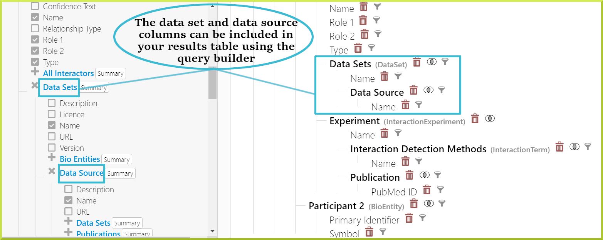
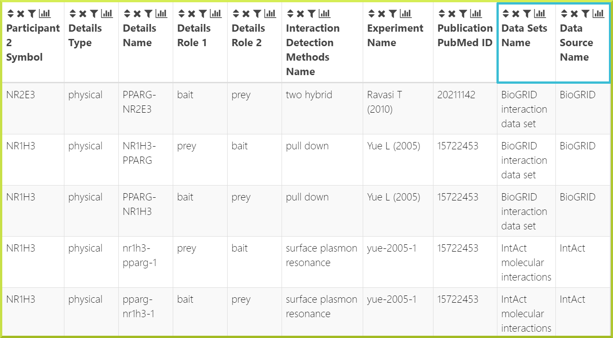

# Data Sources

### Browse data sources

The BlueGenes application includes a link to all data sources on the homepage, which provides details of all data included in the database. This link applies to all InterMine instances. You can browse the full set of data available, including data set name, publications and links to the original data source by clicking the **Show Sources** button. The data sources will be displayed as a standard results table, as shown below. 

### Data in the database

The source of all data is stored in the data source and data set classes within the database. The data source stores the main data provider, such as a database; while the data set represents any individual sets of data from that data source. For example, an InterMine may load Gene Ontology data for several organisms from the Gene Ontology Consortium. The data source is the Gene Ontology Consortium, while each organism's data will be recorded as a data set.  

Data sets and data sources can be included in queries results;  this is particularly useful if the same type of data is loaded from different sources. For example, HumanMine loads interaction data from two data sources, **IntAct** and **BioGRID**. 

For more on how to add information to the query results, see [Adding additional columns of data to your results](https://app.gitbook.com/@user-documentation-intermine/s/user-documentation/~/drafts/-MSDnZ5Mtm-J1k6RNEwn/content/user-documentation/results-tables#adding-additional-columns-of-data-to-your-results), or [The Query Builder](the-query-builder.md).

