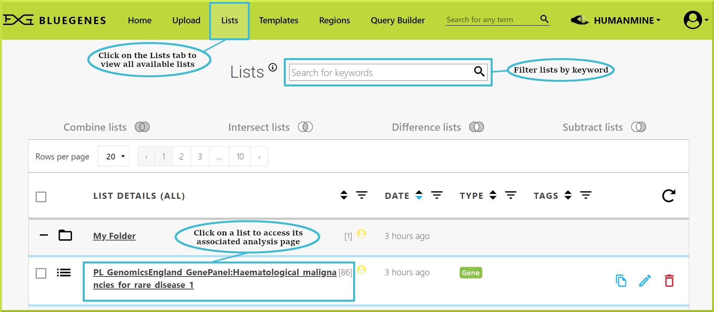
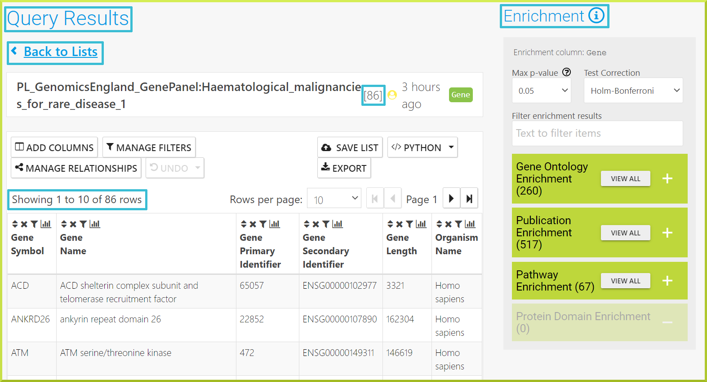

# List analysis

### Overview

Every list has an associated list analysis page. A list analysis page is analogous to a gene report page that provides collated information about all objects in a particular list. When you upload a new list, you will be automatically taken to its list analysis page. To access the list analysis page for public lists that are already in the database, click on the [Lists](lists.md) tab. Clicking on a list name will display its associated analysis page. 


Remember, you must be logged in to view your private lists!


### The list summary

The list summary provides the main identifiers for the objects in your list. For example, the next screenshot shows 86 rows for all 86 genes in the selected list. The list summary page is a form of Query Results - [Results Tables](https://flymine.readthedocs.io/en/latest/results-tables/Documentationresultstables.html#resultstables) that offers the full functionality of  Query Results - [Results Tables](https://flymine.readthedocs.io/en/latest/results-tables/Documentationresultstables.html#resultstables) page. It also includes the List **Enrichment Statistics** on the right of the analysis page, as well as the **GO-term Visualizer** at the bottom of the page. 


You can expand any enrichment widget or the visualizer by clicking on the ➕icon.  


### What does enrichment mean and how are the p-values calculated?

‘Enrichment’ means that the feature \(GO term, domain etc\) occurs for those genes more than would be expected by chance. It is calculated using the hypergeometric distribution which is described further in the [InterMine documentation](http://intermine.readthedocs.org/en/latest/embedding/list-widgets/enrichment-widgets/)

The InterMine enrichment widgets also provide the choice of three methods for multiple test correction - Bonferroni, Holm-Bonferroni and Benjamini Hochberg. These are also described further in the [InterMine documentation](http://intermine.readthedocs.org/en/latest/embedding/list-widgets/enrichment-widgets/)

### Why are some of my genes not analysed in an enrichment widget?

Often, a certain number of genes in an enrichment calculation cannot be included. This is because the data being analysed is not available for these genes. For example, not all genes have GO annotations or protein domains. They are therefore excluded from the analysis.

### What is the background population for an enrichment widget?

The background population, or reference, is by default, all objects in the organism that have annotations of the type being calculated. For example, for the GO enrichment widget, the background/reference population is all genes \(for that organism\) that have a GO annotation. The background population can be changed to one of your choice. To change the background you need to have the set you wish to use saved as a list. This set should also contain all the objects in the list you are analysing \(e.g all the genes in your list\).

🖼 

### What does normalise by length mean?

The probability of a given set of genes being hit in a ChIP experiment is amongst other things proportional to their length – very long genes are much more likely to be randomly hit than very short genes are. This is an issue for some widgets – for example, if a given GO term \(such as gene expression regulation\) is associated with very long genes in general, these will be much more likely to be hit in a ChIP experiment than the ones belonging to a GO term with very short genes on average. The p-values should be scaled accordingly to take this into account. There are a number of different implementations of corrections, we have chosen the simplest one. The algorithm was developed by Taher and Ovcharenko \(2009\) for correcting GO enrichment. Corrected probability of observing a given GO term is equal to the original GO probability times the correction coefficient CCGO defined for each GO term.

The correction coefficient is described in the [InterMine documentation](http://intermine.readthedocs.org/en/latest/embedding/list-widgets/enrichment-widgets/)

