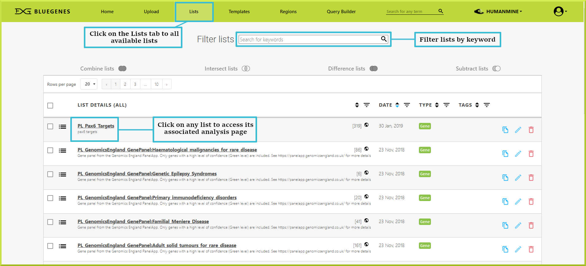

# List analysis pages

## Overview

Every list has an associated list analysis page. A list analysis page is analogous to a gene report page that provides collated information about all objects in a particualer list. When you upload a new list, you will be automatically taken to its list analysis page. To access the list analysis page for public lists that are already in the database, click on the [Lists](lists.md) tab. Clicking on a list name will display its associated analysis page. 


Remember, you must be logged in to view your own lists!


###  The list summary

The list summary provides the main identifiers for the objects in your list. The list summary is a [Results Tables](https://flymine.readthedocs.io/en/latest/results-tables/Documentationresultstables.html#resultstables) and provides all the [Results Tables](https://flymine.readthedocs.io/en/latest/results-tables/Documentationresultstables.html#resultstables) functionality.

🖼 

## Converting a list to another type

A list of objects can be converted to a related list of objects through the list analysis pages. For example, if you have a list of genes, you can convert this into the list of corresponding proteins or a list of all the exons or transcripts for that set of genes: 

🖼 

## Converting a list to homologues

If you are viewing a gene list you can convert this to the equivalent set of homologous genes for another organism. You can also [Open another organisms MOD-intermine via the orthologues of your list](https://flymine.readthedocs.io/en/latest/lists/analysis/Documentationlistanalysispages.html#listanalysisjumptomine).

🖼 

## Open another organisms MOD-intermine via the orthologues of your list

InterMine databases are available for Human, mouse, rat, zebrafish, fly, worm and yeast. See [the InterMOD project](http://intermod.intermine.org/) for more details. It is possible to link to one of these databases with the homologues of the list you are viewing:

🖼 

## What is a widget?

A widget is a graph or table that provides some analysis on your list. The widgets that are displayed depend on the type of list you are viewing and which MOD-intermine you are in. For gene lists, for example, there are widgets that show the chromosome distribution, orthologues and gene expression patterns of the genes and enrichment widgets for Gene Ontology, miRNAs, protein domains, disease terms, publications and pathways. Widgets are automatically displayed on your list analysis page - simply scroll down a bit if you can’t see them, however, there is also a menu option where you can turn widgets on and off:

🖼 

## How do I view or save the genes from a widget?

All the widgets are interactive. For standard bar graphs it is possible to click on each bar to access the objects that just that bar refers too. From here you are given the option to either view the objects or create a list of the objects. In addition, it is possible to view the entire graph as a table:

🖼 

For enrichment widgets it is possible to view or download the entire table or view/create lists of subsets. The number of Matches is the number of genes in your list with that property \(GO term, domain etc\). Clicking on the number allows you to view or create a list of just that set:

🖼 

## What does enrichment mean and how are the p-values calculated?

‘Enrichment’ means that the feature \(GO term, domain etc\) occurs for those genes more than would be expected by chance. It is calculated using the hypergeometric distribution which is described further in the [InterMine documentation](http://intermine.readthedocs.org/en/latest/embedding/list-widgets/enrichment-widgets/)

The InterMine enrichment widgets also provide the choice of three methods for multiple test correction - Bonferroni, Holm-Bonferroni and Benjamini Hochberg. These are also described further in the [InterMine documentation](http://intermine.readthedocs.org/en/latest/embedding/list-widgets/enrichment-widgets/)

## Why are some of my genes not analysed in an enrichment widget?

Often, a certain number of genes in an enrichment calculation cannot be included. This is because the data being analysed is not available for these genes. For example, not all genes have GO annotations or protein domains. They are therefore excluded from the analysis.

## What is the background population for an enrichment widget?

The background population, or reference, is by default, all objects in the organism that have annotations of the type being calculated. For example, for the GO enrichment widget, the background/reference population is all genes \(for that organism\) that have a GO annotation. The background population can be changed to one of your choice. To change the background you need to have the set you wish to use saved as a list. This set should also contain all the objects in the list you are analysing \(e.g all the genes in your list\).

🖼 

## What does normalise by length mean?

The probability of a given set of genes being hit in a ChIP experiment is amongst other things proportional to their length – very long genes are much more likely to be randomly hit than very short genes are. This is an issue for some widgets – for example, if a given GO term \(such as gene expression regulation\) is associated with very long genes in general, these will be much more likely to be hit in a ChIP experiment than the ones belonging to a GO term with very short genes on average. The p-values should be scaled accordingly to take this into account. There are a number of different implementations of corrections, we have chosen the simplest one. The algorithm was developed by Taher and Ovcharenko \(2009\) for correcting GO enrichment. Corrected probability of observing a given GO term is equal to the original GO probability times the correction coefficient CCGO defined for each GO term.

The correction coefficient is described in the [InterMine documentation](http://intermine.readthedocs.org/en/latest/embedding/list-widgets/enrichment-widgets/)

## Template results on list analysis pages

List analysis pages include a set of [Template Searches](https://flymine.readthedocs.io/en/latest/templates/Documentationtemplatesearches.html#templatesearches). These are found at the bottom of the list analysis page and are a set of searches that are automatically run on your list so you can immediately access the results. The results are presented in [Results Tables](https://flymine.readthedocs.io/en/latest/results-tables/Documentationresultstables.html#resultstables) and provide the full functionality of [Results Tables](https://flymine.readthedocs.io/en/latest/results-tables/Documentationresultstables.html#resultstables).

🖼 

