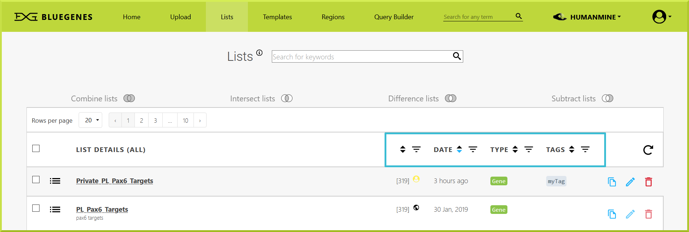
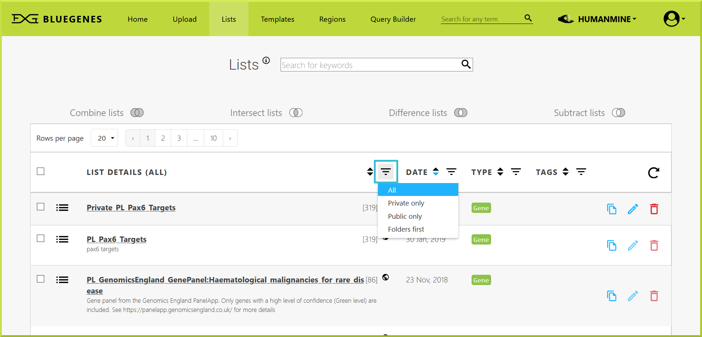
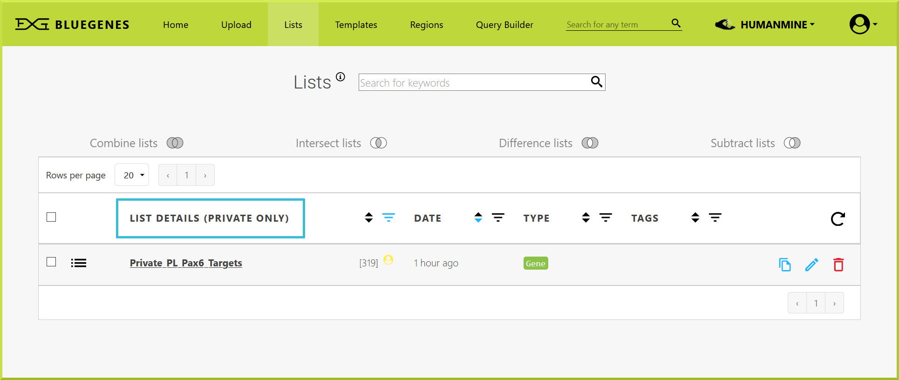
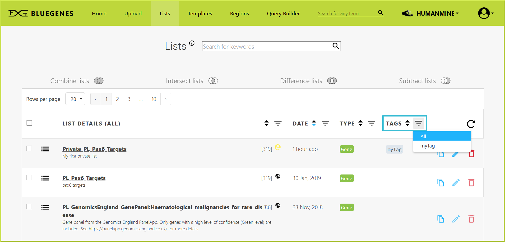
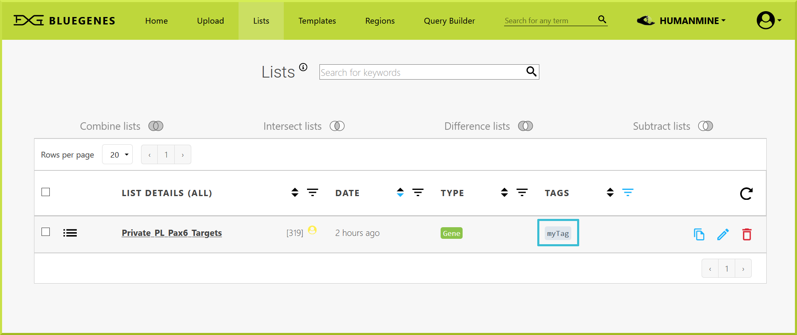
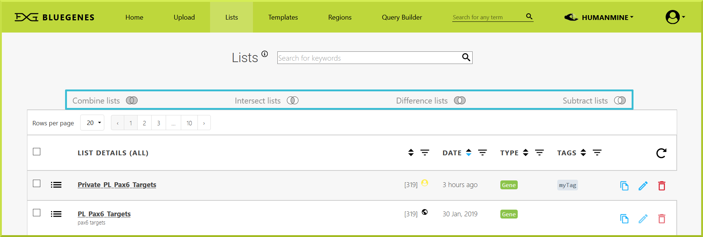
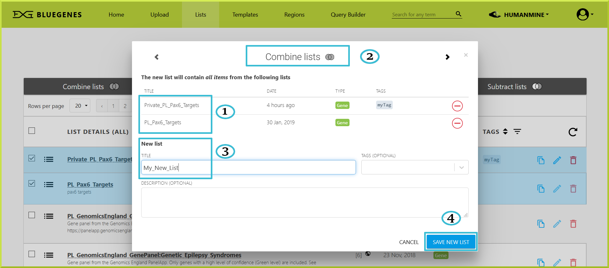

# Lists

### Overview

A **list** in InterMine refers to multiple items of the same type - for example, a list of genes or a list of binding sites. A list cannot contain a mixture of types - e.g. genes and proteins. To access the lists library, click on the **Lists** tab in the main menu bar. 

The following list is a breakdown of what each key item in your **Lists** tab means: 

1. You need to be logged in to your InterMine accountto have access to your stored lists and to accomplish certain tasks that are not available to guests, including copying, editing and deleting lists. 
2. You can filter lists by typing in any keyword in the search field
3. You can analyse your lists using the given set operations. These operations are inactive by default, and you need two or more lists to activate them. Please check [List set operations](https://user-documentation-intermine.gitbook.io/user-documentation/content/user-documentation/lists/lists#list-set-operations) ****for more details.
4. You can control the number of rows shown per page to 20, 50, or 100
5. You can sort lists by date, type, tags, etc. 
6. This iconrepresents a public list 
7. Controls to copy, move, or delete a given list or a group of lists

### What is a public list? 

A public list is a list that has been created by InterMine developers and is ready for use. For example, FlyMine has public lists for sets of transcription factors in _Drosophila_. You can use these publicly available lists for analysis or to run a particular search. 


You cannot modify a public list. You need to make your own copy of a particular public list before you can edit it. Please check [How do I copy a list?](https://user-documentation-intermine.gitbook.io/user-documentation/content/user-documentation/lists/lists#how-do-i-copy-a-list) for more details.


### How do I make a list?

Lists can be created internally - for example from [Results Tables](https://flymine.readthedocs.io/en/latest/results-tables/Documentationresultstables.html#resultstables) or [Region Search](https://flymine.readthedocs.io/en/latest/region-search/Documentationregionsearch.html#regionsearch). They also can be uploaded from an external source via [Upload a list](upload-a-list.md). 


Remember that you need to have an account prior to copying or storing any lists


### How do I view my lists?

By default, when you click on the **Lists** tab, all of your lists will be shown.  Just remember, you need to be logged in to view your private lists. To filter your lists, you can use one of the available filtering options, such as date, tags, etc., shown in the next screenshot. 

For example, you can select to only view your private lists, public lists, lists in particular folder first, or all of your lists at once by using the dropdown menu shown in the following screenshot. 


remember to log in to your account to view and manage your private lists


###  Managing your lists

You can manage your lists through Lists view page. While logged in to your account, you can delete, rename, and upgrade a list, if your identifiers have become outdated.

### Lists tags

Tags can be used to organise your lists into categories. You can add your preferred tags to your saved lists by clicking on the **Edit list** icon✏in the **Lists** view page. 

You can then filter your lists by one of the available tags in the **Lists** view page. 

### Using lists in searches

You can run searches on a list, such as a [template search](../template-search.md) or a search you have built using the query builder. For example, you may want to run a search to find all the GO terms for a list of genes. You can use lists in your searches in the template form - in list option. Check [How do I run a template search with one of my lists or a public list?](https://user-documentation-intermine.gitbook.io/user-documentation/content/user-documentation/template-search#how-do-i-run-a-template-search-with-one-of-my-lists-or-a-public-list) for more information.

### List analysis

All lists have an associated [List analysis pages](list-analysis-pages.md), which provide a summary of your list and several analysis tools. In addition, it is possible to carry out powerful analysis using lists' set operations, including union, intersect, subtract and asymmetric difference. Please see [List set operations](https://user-documentation-intermine.gitbook.io/user-documentation/content/user-documentation/lists/lists#list-set-operations) for more details.

### List set operations

Sets of lists can be analysed using the **Combine**, **Intersect**, **Subtract** and **Difference** functions. These set operations are available in the lists view page. 

To use any of these functions:

> 1. Select two or more lists you wish to analyse
> 2. Select any of the functions
> 3. Provide a name for your resulting list
> 4. Click **Save**
> 5. Your results will appear as a list at the top of the page

For example, you can combine two lists and save the new list as **My\_New\_List**. 


* **Subtract:** This function creates a list that contains the unique entries from **both** lists provided: i.e it is like the opposite of an intersect: if an object is in both lists it will not be in the resulting list, but if it appears in either one, but not the other it will be in the resulting list.
* **Asymmetric difference:** This is more of a traditional ‘subtract’ function, in that the resulting list will contain objects that are in one of the lists only. For example if you have lists A and B and you want to find those unique to list B, use the asymmetric difference function. Note that this function gives you the option to perform the subtraction either way - ie, A-B or B-A.


### How do I copy a list?

You can copy a list either in the lists tab of your personal account or from the lists **view** \([How do I view my list?]()\) page. Select your list and click on **copy**. A new list will be created with the same name and an underscore number. You should see a message at the top of the page informing you of the new list that has been created.

### How do I delete a list?

You can delete a list either in the lists tab of your account or from the lists **view** \([How do I view my list?]()\) page. Select your list and click on **delete**, your list will be deleted straight away.

### How do I rename a list?

To rename a list you must be in your user account. Click on the rename icon next to the list name to provide the new name:

### I am being told to upgrade my lists - what does this mean?

Every time we make a new release of an InterMine database it is possible that some of the gene models will have changed. This means that some of your identifiers may now be out of date. For example, a gene may have been split, in which case an identifier may now refer to more than one gene. Often a gene model is just updated and the old identifier becomes a synonym and the gene is assigned a new identifier. When we make a new release, all the identifiers in your saved lists will be checked against the identifiers in the new database. If any discrepancies are found \(i.e if any have now become synonyms, or refer to more than one gene\) then you will be asked what you want to do about these genes before you are able to use your list again.

A message appears at the top of any page informing you that you have lists that need updating. To update your lists you must be in your user account. Within your lists page, the lists that need updating will be shown first. The list upgrade system is the same as the [The Identifier Resolution page](https://flymine.readthedocs.io/en/latest/lists/upload/Documentationlistupload.html#listconfirmationpage) that you see when you upload a list.

