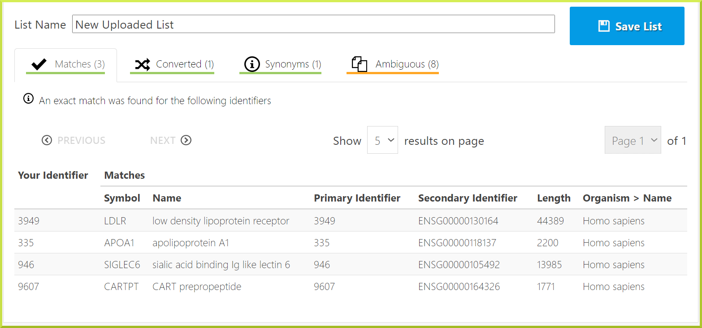
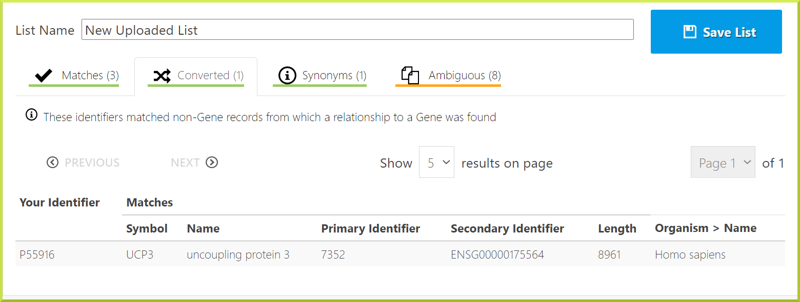
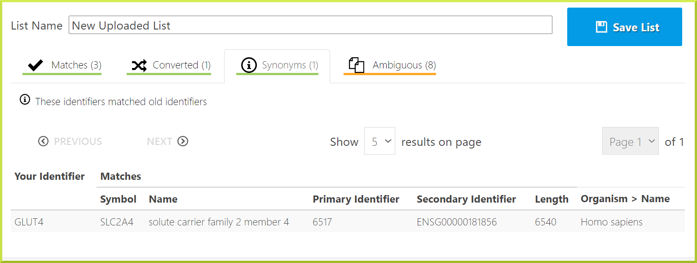
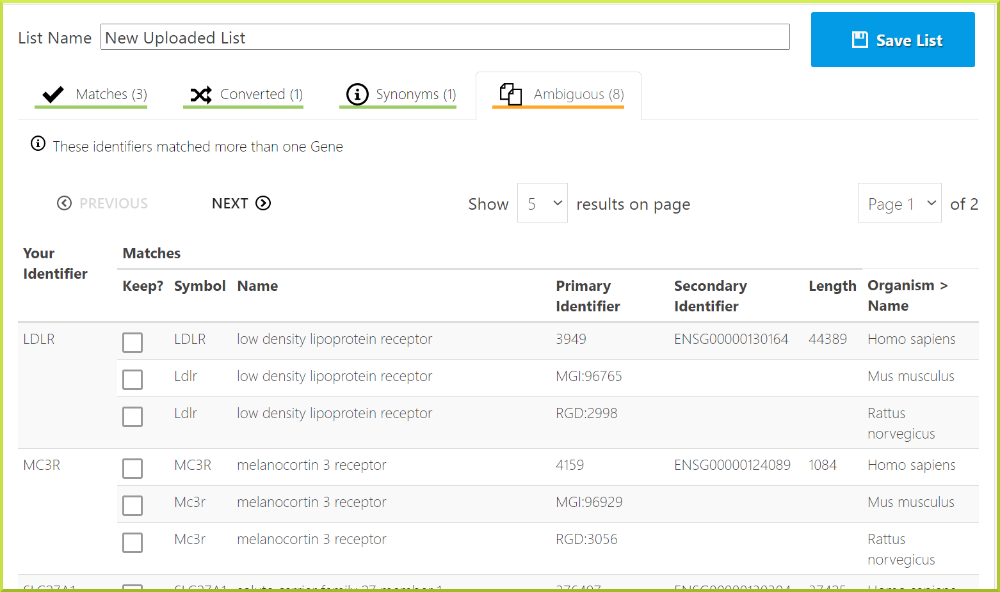

# Upload a list

The BlueGenes application gives users the ability to create new lists by filling in a simple upload form. To upload a list, click on the **‘Upload’** tab. 

The following is a breakdown of key fields in the list upload form: 

1. The type of list - you can select the type of list you are uploading from the drop-down menu, e.g. gene or protein. 
2. The organism your items are from. You can select the organism from the available drop-down menu. However, It is still possible to upload a list containing items from more than one organism by setting the organism to **‘Any’**.
3. Check the box, if list identifiers are case sensitive. This option is useful in some cases, for example, when entering gene symbols for Drosophila melanogaster, where the case matters.  
4. You can type in your list or paste it as a text with identifiers separated by a comma, space, tab or a new line. See the screenshot under the **Free Text** tab below for an example. 
5. If you are unsure how to add your list in text format, click the **Example** button for a sample text. 
6. You can upload a list from a file; however, only **‘.txt’** files are accepted. Although the type of items you are uploading must be the same, the type of identifier can differ. For example, you can enter a mixture of gene symbols, identifiers and names. Check the screenshot under the **File Upload** tab below.  
7. You can click **Continue** to ****activate the identifier resolution system. A search will be performed for all the identifiers in your list. You can click **Reset** to cancel. 











You can click **Save List** to add the list to your stored lists.  ****

### The Identifier resolution page

When you upload a list, all identifiers entered will be checked against the database to see if matches can be found. InterMine has a sophisticated identifier resolution system that will help you map your identifiers to the database's correct identifiers. This is particularly useful if some gene models have changed, and some of your identifiers become out of date. The identifier resolution system will report the following:

1. The number of exact matches found to entries in the database.
2. The identifiers that match a synonym but not a main or primary identifier.
3. Identifiers that match more than one database entry.
4. Identifiers that match a different type - e.g. entering a protein identifier when you upload a list of genes.

The identifier resolution system is also used during InterMine data releases to check that all identifiers in your lists are still valid. Any discrepancies found will be reported to you, and you will be asked to ‘**Upgrade your lists**’. The **Verify identifier matches** page allows you to resolve any conflicts and decide which genes you want in your list. By default, exact matches are automatically added to your list. For any other type of match, you can choose to either add all of them to your list or analyse each one individually and add as required. 

For example, for the **New Uploaded List** created in the previous section, we have the following: 



**Exact matches:** some exact matches were found for the listed identifiers




**Converted types:** these identifiers matched non-Gene records from which a relationship to a Gene was found. For example, we have selected to upload a list of genes, but one of the identifiers is for a protein, uncoupling protein 3. The gene identifier for this protein is given.




**Synonym match:** these identifiers match old identifiers. For example, the GLUT4 identifier is old, and the gene now has a new identifier. 




**Ambiguous:** some of the identifiers matched more than one entry in the database. In this case, the identifiers could belong to different species, and this could have been avoided by selecting the organism on the list upload page. 




