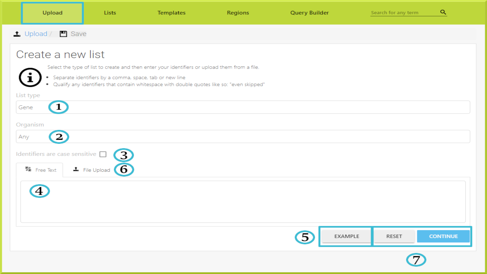
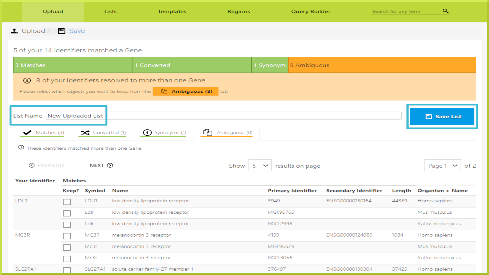
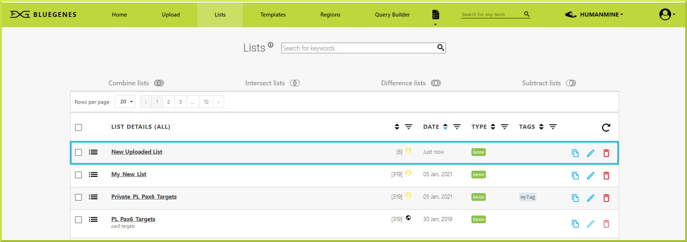

# Upload a list

### Upload a list

To upload a list simply click on the ‘Upload’ tab

The following is a breakdown of key fields in the list upload form: 

1. The type of list - you can select the type of list you are uploading from the drop-down menu, e.g. gene or protein 
2. The organism your items are from. You can select the organism from the available drop-down menu. However, It is still possible to upload a list containing items from more than one organism by setting the organism to ‘Any’
3. Check the box, if list identifiers are case sensitive. This option is useful in some cases, such as when you are entering gene symbols for Drosophila melanogaster, where the case matters.  
4. You can type in your list or paste it as a text; see the screenshot under the **Free Text** tab below. 
5. If you are not sure how to add your list in text format, click the **Example** button for a sample text 
6. You can upload a list from a file; only .txt files are accepted. Although the type of items you are uploading must be the same, the type of identifier can differ. For example, you can enter a mixture of gene symbols, identifiers and names. Check the screenshot under the **File Upload** tab below.  
7. You can click **Continue to** activate the identifier resolution system. The identifiers you have entered are checked against the InterMine database and any discrepancies will be shown on the next page. You can click **Reset** to cancel. 











You can click **Save List** to add the list to your stored lists.  ****

### The Identifier Resolution page

When you upload a list, all the identifiers you enter will be checked against the database to see if they can be found. InterMine has a sophisticated identifier resolution system that will help you map your identifiers to the correct identifier in the database. This is particularly useful if there have been some gene model changes and some of your identifiers are now out of date. The identifier resolution system will report the following:

1. The number of exact matches found to entries in the database.
2. The identifiers that match a synonym but not a main or primary identifier.
3. Identifiers that match more than one database entry.
4. Identifiers that match a different type - e.g if you enter a protein identifier when you are uploading a list of genes.

The identifier resolution system is also used during InterMine data releases to check that all the identifiers in your lists are still valid. Any discrepancies found will be reported to you and will be asked to ‘upgrade your lists’. The **Verify identifier matches** page allows you to resolve any conflicts and decide which genes you want in your list. By default, exact matches are automatically added to your list. For any other type of match you can choose to either add all of them to your list or analyse each one individually and add as required.

**Synonym match:** the identifier you entered, FBgn0001251 is a synonym of FBgn0001325. Your identifier is old and gene now has a new identifier.

**Duplicates:** The identifier you entered, tramtrack, matches multiple identifiers. In this case the identifiers are from different species and this could have been avoided by selecting the organism on the list upload page.

**Converted types:** You have selected to upload a list of genes but one of your identifiers is for a protein, TWIST\_DROME. The gene identifier for this protein is given.

