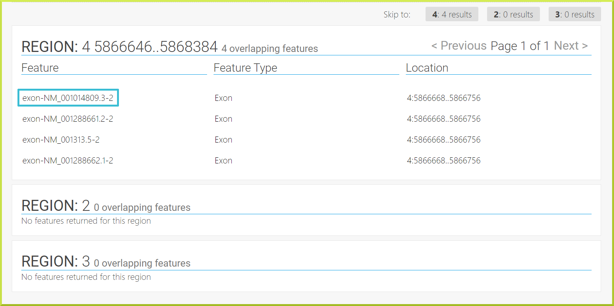
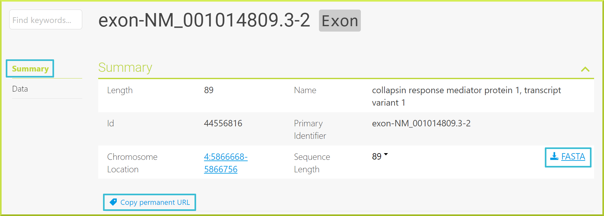
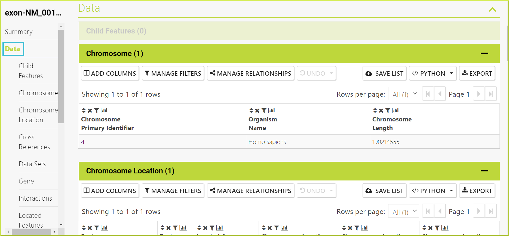

# Region Search

### Overview

The Region Search allows you to search for features that overlap a list of genome coordinates. It is found under the **Regions** tab in the main InterMine header.

1. First, type in chromosome coordinates in the box with each input coordinates or genomic region needs to be on a separate line. The following formats are accepted:  
   * chromosome:start..end, e.g. 2:14615455..14619002 
   * chromosome:start-end, e.g. 4:5866646-5868384
2. Select the organism for which your regions are from. By default, all organisms are selected. 
3. Select which features you are interested in to include. By default, all are features are included.
4. If you are unsure, click **Show Example** for sample coordinates or click **Search** to run your query. 


Like most genome portals, such as NCBI, bioinformatics software, such as BLAST, and annotation file formats like SAM and VCF, BlueGenes use the[ base coordinate system](http://bergmanlab.genetics.uga.edu/?s=coordinate), representing a feature starting at the first nucleotide as position 1. 


### Regions Search Results

The regions search provides results in a tabular format. The resulting table displays each of your regions in turn with all features found and their genomic location.  

You can click on any feature to expand more details about that feature. For example, clicking on **exon-NM\_001014809.3-2** will direct you to a more detailed page about that feature. The left-hand column shows two sections, **Summary** and **Data**. The Summary can be downloaded in FASTA format, and you can use the **Copy permanent URL** to share or have a reference to the resulting report. The URL will continue to work through database rebuilds and will return the report for this object.

The Data section provides more information about the selected feature using Results Tables. Check the [Results Tables](https://flymine.readthedocs.io/en/latest/results-tables/Documentationresultstables.html#resultstables) section for more details on managing, saving or exporting each data table.

### Troubleshooting

### I have saved my genomic regions from a query - how do I upload them to the region search?

BlueGenes does not support uploading genomic regions directly from the results of an InterMine search into regions search. You first need to download the regions, and then reformat them to one of the accepted formats. 

