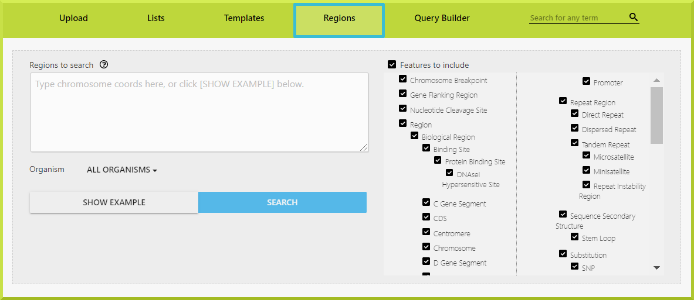
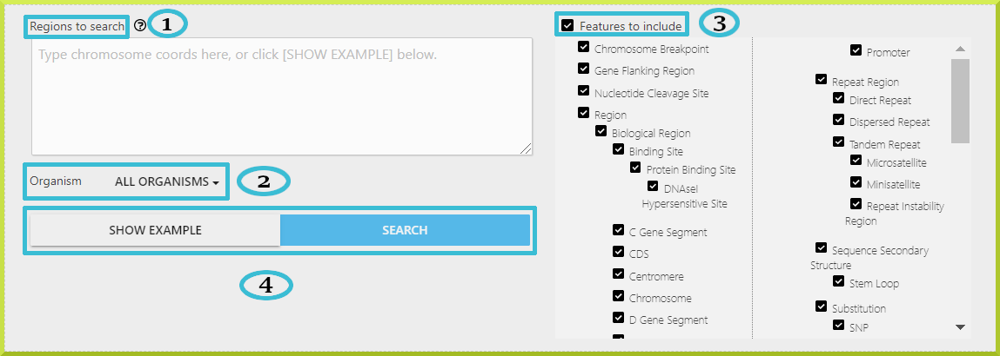

# Region Search

The Region Search allows you to search for features that overlap a list of genome coordinates. It is found under the **Regions** tab in the main InterMine header.

1. First, type in chromosome coordinates in the box with each coordinates entry on a seperate line. The following formats are accepted: 
   * chromosome:start..end, e.g. 2:14615455..14619002 
   * chromosome:start-end, e.g. 4:5866646-5868384
2. Select the organism for which your regions are from. By default, all organisms are selected. 
3. Select which features you are interested in to include. By default, all are features are included.
4. If you are unsure, click **Show Example** for sample coordinates or click **Search** to run your query. 

Note that you must also select the coordinate system of your regions. Both **base coordinate** \(e.g. BLAST, GFF/GFF3\) and I**nterbase coordinate** \(e.g. UCSC BED, Chado\) systems are supported. For example, for a DNA piece **GCCATGTA**, the position of the **ATG** in Interbase is \[3, 6\], and in base coordinates, it is \[4, 6\]. Users need to select which coordinate system they are using. This is base coordinate by default.

Each genomic region needs to be on a separate line.

1. Next, you can choose to extend your regions by a certain number of bases upstream and downstream. Note that this currently extends your region in both directions by the amount specified.
2. Finally, on some InterMine installations, there will be a checkbox to restrict searches to a specific strand. For example, Chr1:12345-23456 indicates a region on the + strand; Chr1:23456-12345 indicates a region on the - strand. One situation in which this is useful is when you have a series of BLAST-generated regions on which you’d like to search for upstream gene flanking regions. In this case, there is no point in matching with gene flanking regions on the opposite strand. The default behaviour is to search both strands.

## Region Search Results

The region search provides results in two formats: in a genome browser and as a table \(Note; genome browser is not currently configured for FlyMine\).

### 1. The genome browser

Note that the genome browser will initially display a default region or the last region you looked at. To display one of the regions from your current query, click on the region link from the table display. The genome browser will display the Gene track for that region. Further tracks available are shown on the left and can be pulled onto the view.

### 2. The table

The table display shows each of your regions in turn. The left-hand column shows the region and allows you to download the results for just that region in various formats \(tab, csv, gff3, FASTA and BED\) or send your results to the galaxy. You can also create a list of a specific type of feature. Download and list creation for all regions is found just above the table under the genome browser. The right hand side of the table displays all the features found and their genomic location.

### Troubleshooting

### I have saved my genomic regions from a query - how do I upload them to the region search?

At present, it is not possible to upload genomic regions directly from the results of an InterMine search into the region search. You need to download the regions and reformat them first. This is something we hope to rectify in the future.

