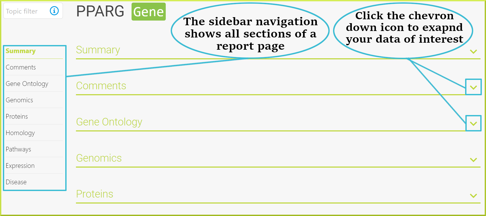
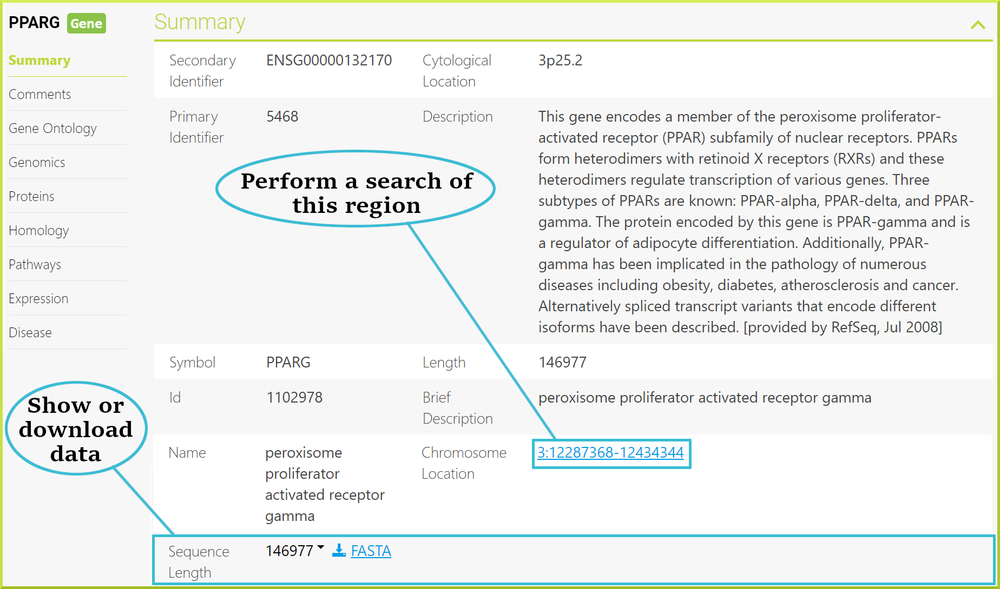
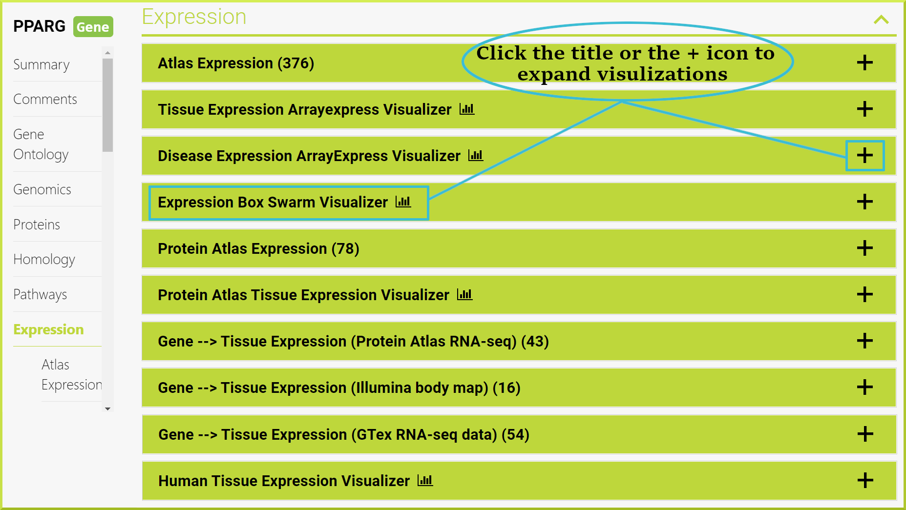
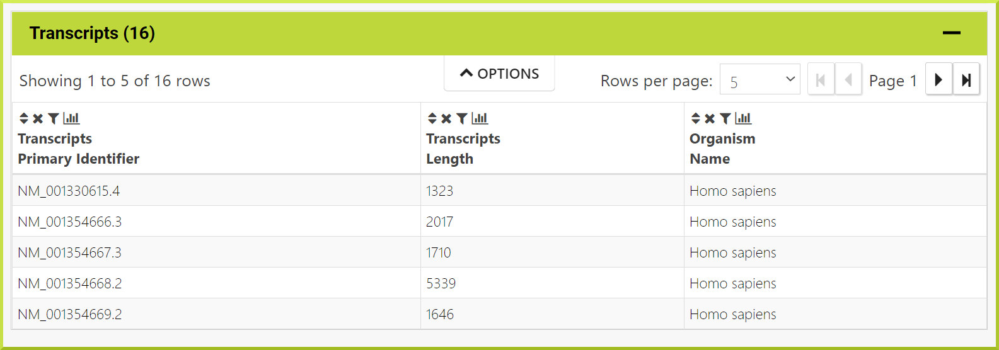
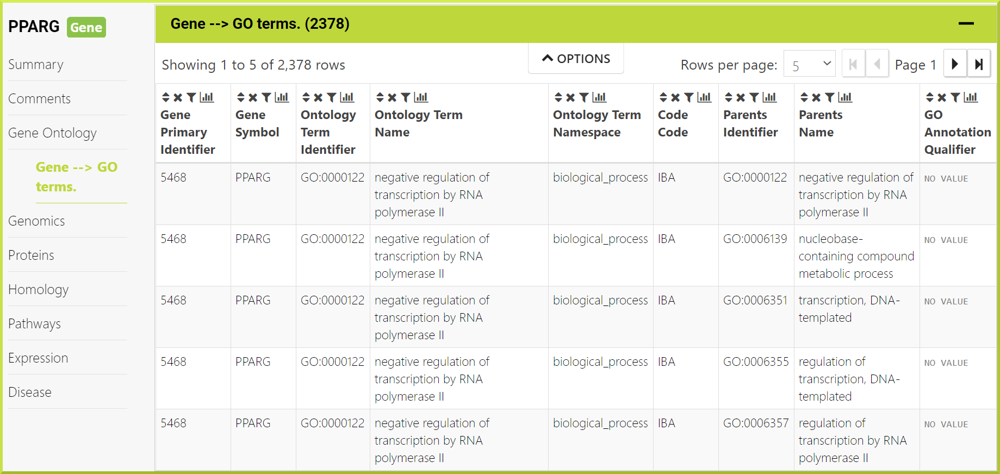
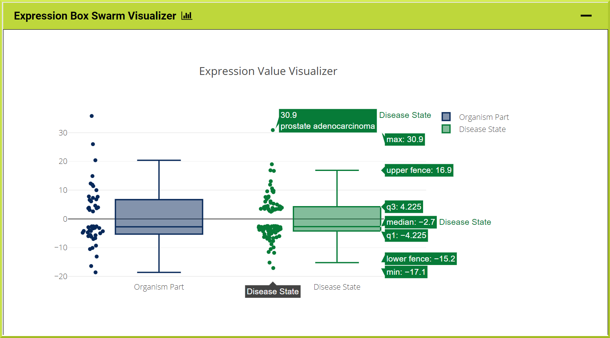
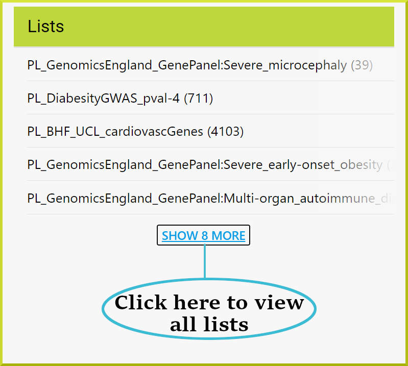
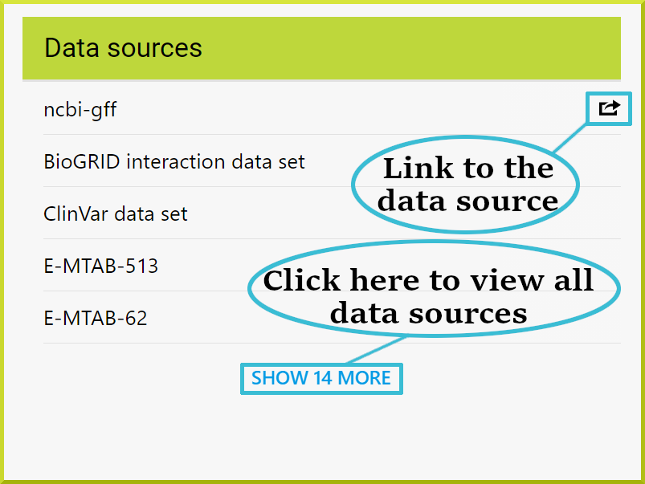

# Report Pages

Report pages allow you to view all available information on a particular object, such as a protein or a publication, and provide links to other related items. Every item in your search results or lists has its own report page that you can access. For example, you can start by searching for the PPARG gene symbol and then click on that symbol to be directed to the gene’s report page. 

### Report page navigation

The sidebar navigation menu on the left of every report page allows quick navigation to the data you are interested in. You can navigate to a different section by clicking the section name from the left sidebar, and you can expand any section by clicking on the chevron down icon. The following image shows the PPARG gene report page. 


Remember that the sidebar navigation sections are not the same for all objects nor all intermine instances.


It is possible to keep a reference to a particular report page by copying its permanent URL. Permanent URLs use identifiers unique to the object and must be resolved to an object ID by InterMine. This makes them less suitable than object IDs for daily use; however, these URLs will stay valid even when new versions of the database are released.

#### Sharing a report page

You can also share a report page with others by copying its permanent URL that is unique to every object. This provides the URL you should use to create a persisting link to a given page. 

### Summary

Each report page starts with a summary section providing key details of the object you are viewing, such as the primary and secondary identifiers, name, id, and symbol, among other information. Some data fields are interactive, such as the **Name** field that offers a link to perform a [region search](region-search.md). 

#### Sequence information

If you are viewing an object that has a sequence, you can view or download this data in **FASTA** format.  In the image below, the **Sequence Length** field allows you to view the sequence in a new window by clicking the arrow icon. You can also download the data as a FASTA file by clicking on the **FASTA** button next to the Length.  

### Data displayers

Report pages provide information in a variety of formats depending on the data. For example, they include several graphs or visualizations of data under some of the [main sections](report-pages.md#report-page-navigation). The following screenshot shows available visualization tools under the Expression section. You can view any visualization by clicking on its title or the➕icon. 


Remember visualization tools apply to all report pages for a specific class, such as Gene, and are not the same for different objects - classes - nor Intermine instances. 


Report pages also include [results tables](results-tables.md) of other classes referenced from the current object's class. The image below shows the **Transcripts** class referenced from the PPARG gene - Gene class. 

Report pages offer templates under some of the left sidebar ****[sections](report-pages.md#report-page-navigation). The results of embedded template searches provide [results tables](results-tables.md) with their full functionality, as shown in the screenshot. 

### Interacting with report pages

Most of the data elements displayed on a given report page are interactive to some extent. For example, some data fields provide links to related objects that they reference, and bars or elements on a graph, such as the dots in the image below, often link to additional information.  

### External links

Report pages provide two sorts of external links - links to other InterMine databases and external sources. Links to other InterMine databases are only available for genes. The link will be created either from the same gene object or the orthologous gene in the database you are linking to. For example, the _PPARG_ gene in HumanMine links to the _Eip75B_ gene in FlyMine - an integrated Drosophila genomics database. The orthology mapping is determined by the InterMine database you are linking to. The orthology datasets in each InterMine can be from different sources.


Please note that the BlueGenes interface does not currently support external resources in BlueGenes.


### Lists

The report pages also show if the object you are viewing is present in any lists. The lists shown could be lists you have created yourself or public lists that are available to everyone - view the [Lists](lists/lists.md) section for more details. The following image shows that the PPARG gene was found in 13 lists; 12 are public lists, and one is private. 

### **Data sources**

Report pages include a list of data sources. Some items in this list may offer links to the data source, which opens in a new window. 

\*\*\*\*

