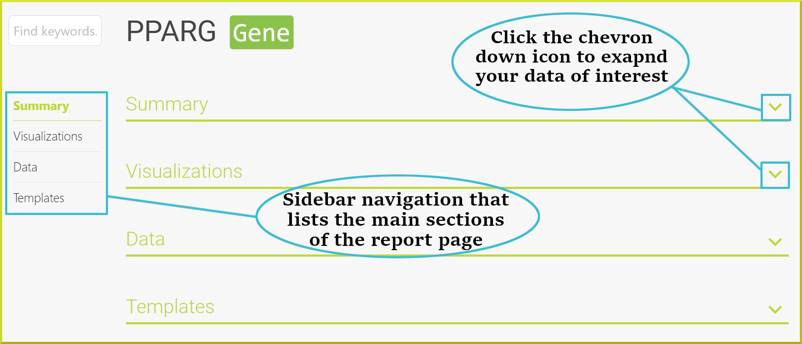

# Report Pages

Report pages allow you to view all available information for a particular object and provide links to related objects. There is a report page for any object so that every gene, protein, binding site, publication etc., has its own report page. 

### Report page navigation

The sidebar navigation menu on the left of every report page allows quick navigation to the data you are interested in. You can navigate to a different section by clicking the section name from the left sidebar, and you can expand any section by clicking on the chevron down icon. The following image shows the PPARG gene report page. 

### Summary

Each report page starts with a summary section providing key details of the object you are viewing, such as primary and secondary identifiers, name, id, and symbol among other information. The summary section usually allows you to keep a reference to a particular report page by saving its permanent URL. Permanent URLs use identifiers unique to the object and need to be resolved to an object ID by InterMine. This makes them less suitable than object IDs for daily use; however, these URLs will stay valid even when new versions of the database are released.

### Visualizations

### Data displayers

Report pages provide information in a variety of formats depending on the data. They include summary tables of information, for example:

graphs of data, for example, expression data:

and interactive viewers, for example, protein interaction data:

### Templates

### Interacting with report pages

Most of the data displayed on report pages is interactive to some extent. Tables of data provide links to the related objects that they reference \(see image above\), bars on a graph are often links to additional information, and the results of embedded template searches provide the [Results Tables](https://flymine.readthedocs.io/en/latest/results-tables/Documentationresultstables.html#resultstables) with their full functionality.

### External links

Report pages provide two sorts of external links - links to other InterMine databases and links to external sources. Links to other InterMine databases are only available for genes. The link will be created either from the same gene object or the orthologous gene in the database you are linking to. For example, the _Drosophila_ zen gene in FlyMine links to the Human HOXC5 gene in metabolicMine \(a database of largely Human data\). The orthology mapping is determined by the InterMine database you are linking to. The orthology datasets in each InterMine can be from different sources.

### Lists

The report pages also show if the object you are viewing is present in any lists. The lists shown could be lists you have created yourself or public lists that are available to everyone \(see [Lists](https://flymine.readthedocs.io/en/latest/lists/overview/Documentationlists.html#lists)\). In addition, you can add the object to any of your own lists.

### Sequence information

If the object you are viewing has a sequence, you can access this in FASTA format from the summary section of the report page: Click on the **FASTA** button next to the Length. The sequence will open in a new tab.

### Sharing a report page

Every report page has a **share** button. This provides the URL you should use if you want to create a link to the page. The **share** button is found in the top section of all report pages

