# Results Tables

Running any search from the available [template searches ](template-search.md)or using the [query builder](the-query-builder.md) will return results as a results table. Results tables are also used to display the contents of a particular list on list analysis pages. Results tables are not limited to displaying search results, but they are also considered powerful analysis tools. They allow you to summarise, filter, add or remove columns, create lists, and download data.

### Understanding and navigating through the data

The first thing to note on results tables is the number of rows returned by your query. By default, the number of rows shown per page is10 and can be changed to 20, 50, 100, or 250 rows per page. For large data sets, you can navigate through your results one page at a time using the backward and forward arrow icons◀▶, or you can go straight to the last or the first pages using the skip icons .  

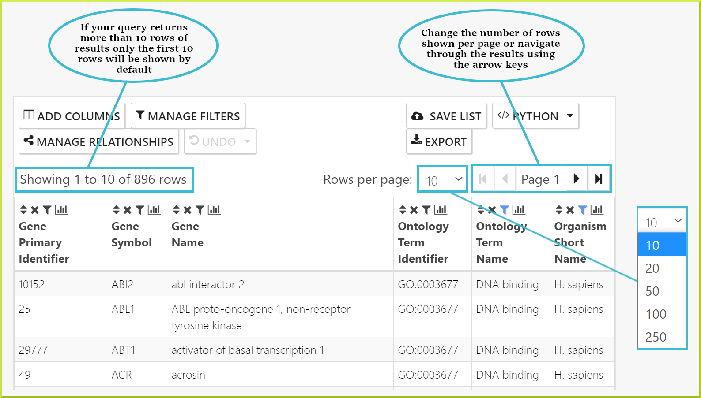

The second thing to note is the column headings, which give the field name for the data shown and - in some cases - the class the data comes from. For example, in the following results table, the first two columns give a gene primary identifier and a gene symbol. The next column gives the gene name and the pathway identifier, and so on. 

### Finding out more - links

Columns showing certain object identifiers or symbols will be linked to the [Report Pages](report-pages.md) for that object. In addition, hovering over a given cell in the table shows a pop-up summary of the object, which gives more details about its main attributes. 

### Column summaries

A summary of the data in each column of a results table can be accessed by clicking on the graph iconin the column header.

The type of summary shown depends on the type of data in the column - whether it is text or numerical data. For example, the results table below is showing pathways associated with the Pax6 targets list. Therefore, the summary for the pathway **Name** column shows how many genes are associated with the same pathway. 

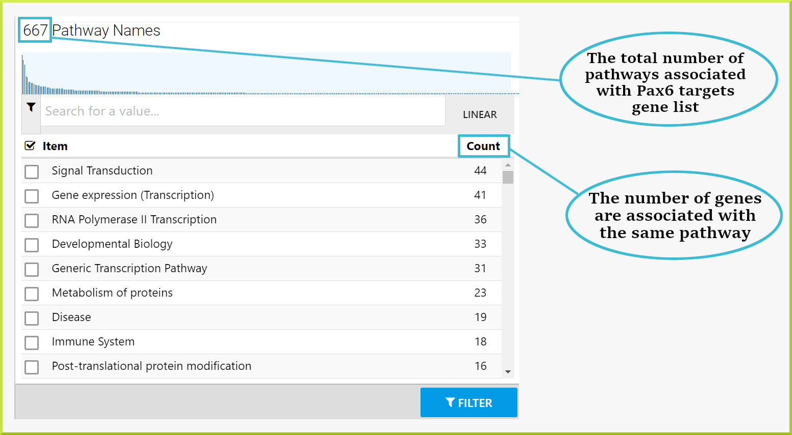

Whereas, the following column of numerical data - gene lengths in the following screenshot - shows the minimum and maximum values, the mean, and the standard deviation of the data.

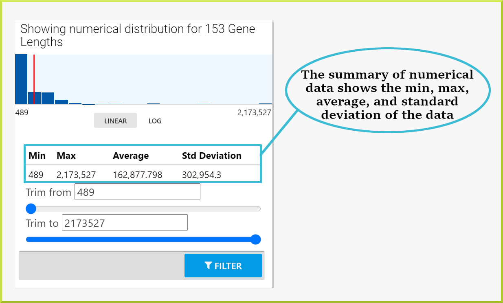

Results can also be filtered through the column summary depending on the type of data. For text data, you can filter by selecting the relevant checkbox\(s\) or enter some text value in the search field and then select the relevant checkbox\(s\). For numerical data, use the sliders to select the range of data you wish to view. Click the **Filter** button to re-draw the table with your added filters. 

To remove a filter, either click the **UNDO** button at the top of the table or the filter icon in the column header and remove it from there. 

**Column summary graph:**

The graph shown at the top of a column summary gives an idea of the data's linear and log distribution. 

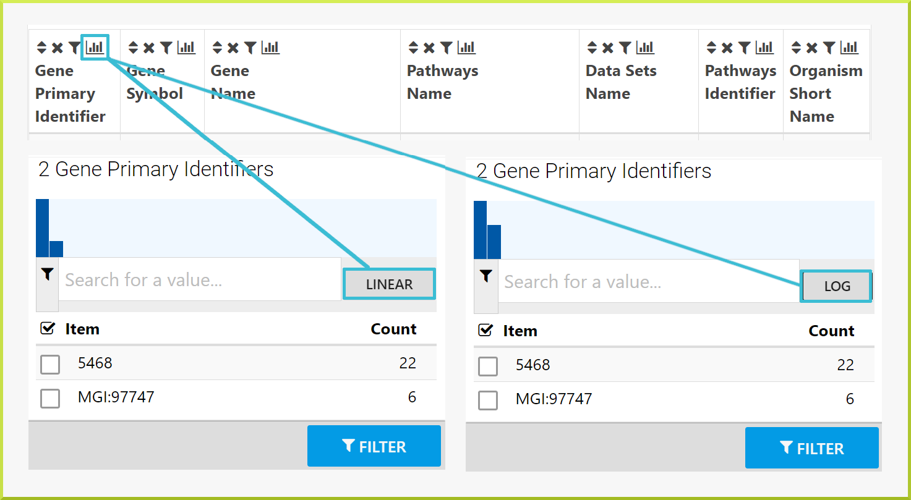

### Some applications of column summaries:

Column summaries are useful for several reasons. The following are a few ideas for how they can be used:

* For a list of genes, find how many have the same annotation, where annotation could be anything associated with your genes such as GO terms, pathways or diseases.

You have a public list of Pax6 genes, **PL\_Pax6\_Targets**, and want to find out which pathways they are involved in. You can run the $$Gene → Pathways  $$template with your list of genes. The results table shows your genes and the names of all pathways they are annotated with. By clicking on the **column summary** for the _pathway.name_ column you can now find out how many genes are associated with each pathway. In the example shown below, 44 of the genes in the list are associated with the **Signal Transduction** pathway. If you wish to analyse this set of genes further, you can filter the table for this set and then create a new list with this set of genes. Check the [Save a result set for further analysis](https://app.gitbook.com/@user-documentation-intermine/s/user-documentation/content/user-documentation/results-tables#save-a-result-set-for-further-analysis) section for how to create a sub-list of genes. 

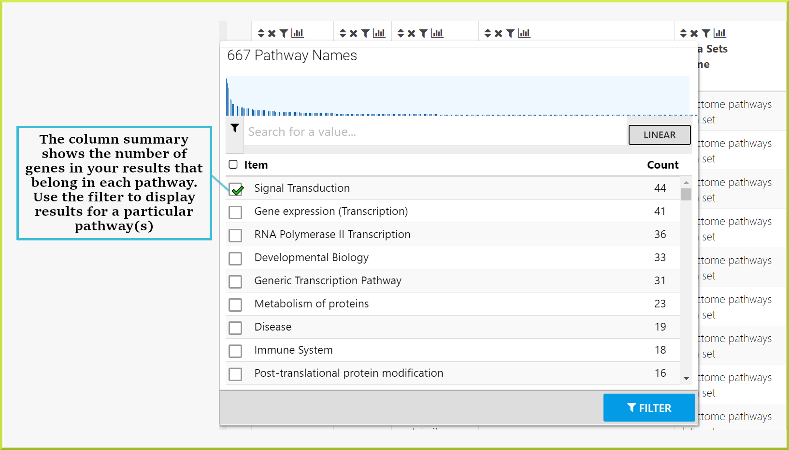

* Find the number of unique genes in your results.

Often a results table will have multiple rows with information about several genes. By looking just through the table, it will be difficult to know how many genes you have in your results. You can use the column summary to give you this information.

For example, when you run the$$Gene → Pathways$$template search with the same public list - **PL\_Pax6\_Targets** - ****to determine which pathways the genes in the list are involved in, the results table gives 1,575 rows.  However, there are multiple genes associated with a single pathway, which means you do not know how many genes you have. When you click on the **column summary** for either the gene primary or secondary identifiers or the gene symbol, you can find the number of unique genes. As shown in the following screenshot, there are 153 genes. 

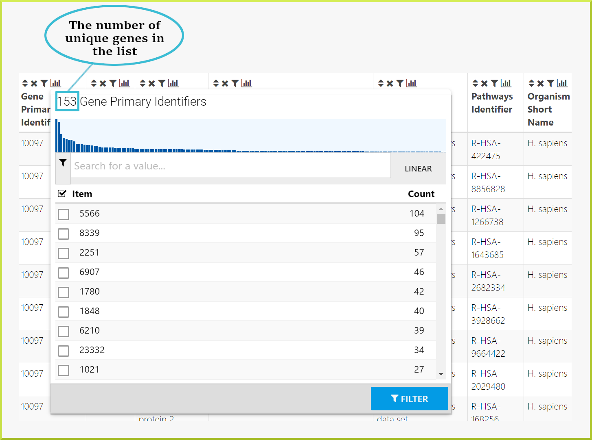


Note that if you want to create a list of these genes, you will create a list of 153 unique genes. Please see the [Save a result set for further analysis](https://app.gitbook.com/@user-documentation-intermine/s/user-documentation/content/user-documentation/results-tables#save-a-result-set-for-further-analysis) section for more details. 


Results by default are always returned with what we call an inner join. So, in the example above, if a gene in the list does not have associated pathway data then it will not appear in the results. This can be changed - see the [Query Builder - Outer joins](https://app.gitbook.com/@user-documentation-intermine/s/user-documentation/~/drafts/-MSZ-rWrsFFJa1oY4hb_/content/user-documentation/the-query-builder#outer-joins) section for more details. 

### Apply a filter to your results

Results tables allow you to explore your results by applying filters to any of the resulting data columns. Filters can be applied through the **filter** iconin the column header and the [Column summaries](https://app.gitbook.com/@user-documentation-intermine/s/user-documentation/content/user-documentation/results-tables#column-summaries). The filter icon allows you to edit or remove any existing filters, and add additional filters to your results. Any active filters are shown and can only be removed or edited when you click the filter icon. 

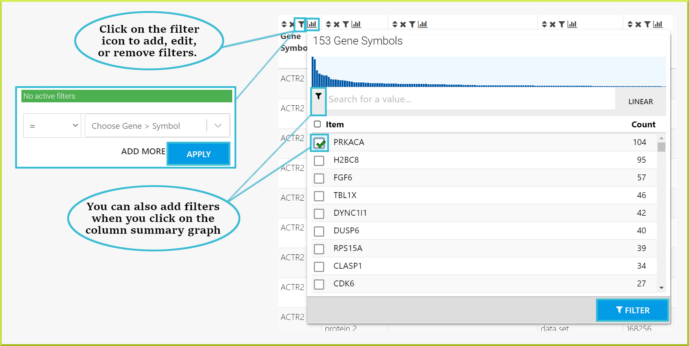

**To add a new filter:**

1. Click on the **filter** iconshown on all columns' headers.
2. Use the drop-down lists and input field to define your filter.
3. Click on **Apply** button to re-draw the results table with your filter in place. 

You can also add, edit or remove filters using the **Manage Filters** button, which provides information on filters added to all columns in the results. 

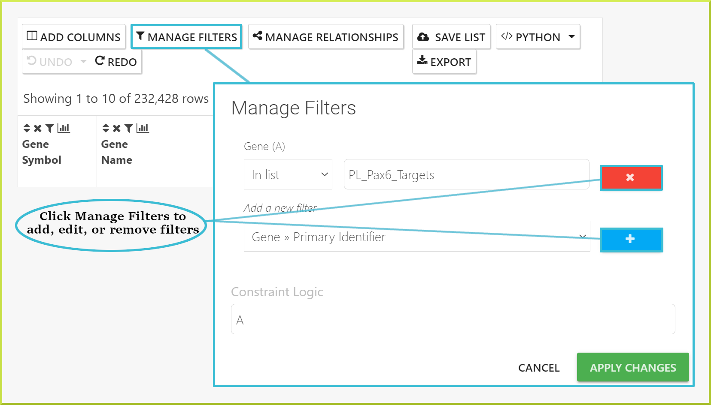

### **Returning to your original results**

Filters can be removed by clicking onicon and then click the delete iconshown below. Alternatively, you can use the **UNDO** button above the results to return to previous states. If you have added multiple filters, you can go back to any previous state of your results table or straight back to original table state.


Note that the original state may still have filters applied. Original state refers to the original query run, not to a table with no filters applied. 


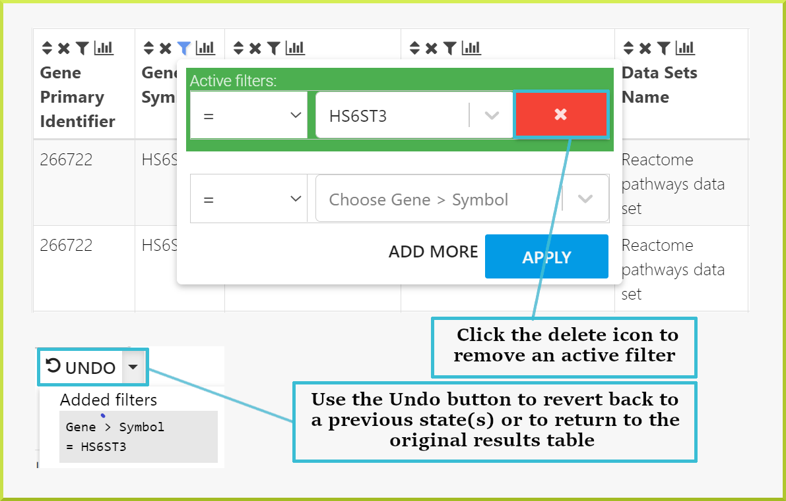

### Adding additional columns of data to your results

Additional fields of data can be added to your results using the **Add Columns** button, which allows you to browse all fields available and select those you wish to add:

1. Click on the **Add columns** button.
2. Browse the fields to find the ones of interest. 
3. Click on any field to add that data to your results.
4. Click **Apply** to re-draw the results table.


If you do not know which field contains the data you require, try adding one or more columns and re-draw the table - it is easy to remove them again. Alternatively, you can [Contact Us](contact-us.md), and we are here to help.


### Removing columns from your results

To remove any column from the list of columns shown in your results: 

1. Click on the delete icon✖in the desired column's header.


To add the deleted column back, click the **Undo** button to revert to the previous state.


### Re-arranging columns in your results

Re-arranging columns is done under the **Manage Columns** tab by dragging and dropping given columns to change their order. Check the [Query Builder](the-query-builder.md) section for more information. 

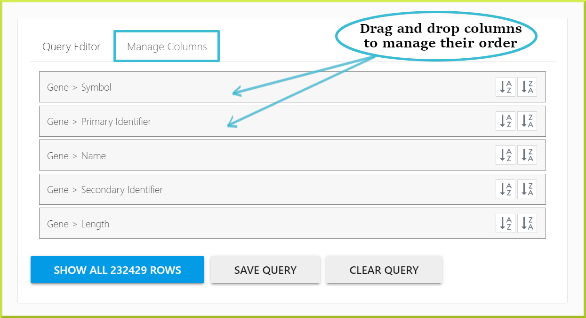

### Changing the sort order of columns in your results

There are two ways to change the sort order of the columns in your results tables. 

* First, every column header has a sort icon which allows you to sort on a specific column in either direction $$a → z$$ or $$z → a$$ 

* The second way to set the sort order is through the [**Query Builder**](https://app.gitbook.com/@user-documentation-intermine/s/user-documentation/content/user-documentation/the-query-builder#overview) ****tab, where you can define the sort order of all columns in your table under the [**Manage Columns**](https://app.gitbook.com/@user-documentation-intermine/s/user-documentation/content/user-documentation/the-query-builder#overview) sub-tab. 

By default, the table is usually sorted according to the first column in your results; however, template searches may be sorted on a column other than the first. 

### Save a result set for further analysis

Lists of objects can be saved from results tables to your private lists account or temporarily for the duration of your session if you are not logged in. A list of objects can contain only one type of object. For example,  if you have a results table showing both genes and proteins, you can create a list of all or some of the genes and another list of all or some of the proteins. However, you cannot create a mixed list of genes or proteins or save the table,  maintaining the association between each gene and protein. You can download the full table or subsets of it - see [Download a set of results](https://app.gitbook.com/@user-documentation-intermine/s/user-documentation/~/drafts/-MS9qjd7kmcfzTt32-tC/content/user-documentation/results-tables#download-a-set-of-results).

You can save a subset of the resulting data in a new list by clicking the **Save List** button at the top of the columns header. You can select from the sets of objects available to save or choose individual items from the table using their corresponding checkboxes. 

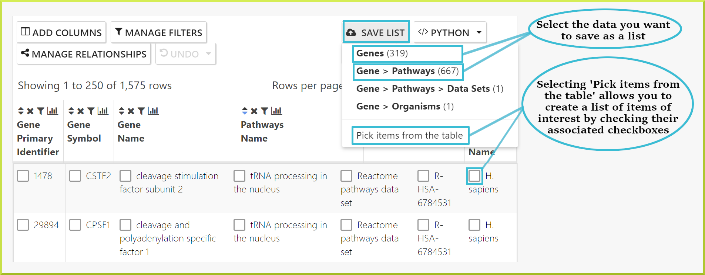

Once you have made your selection, a sample name will be given to your list, including the objects' type in your list, e.g. gene, the date, time of creation, and the time zone. You can edit this name as you wish and click **Save**. 

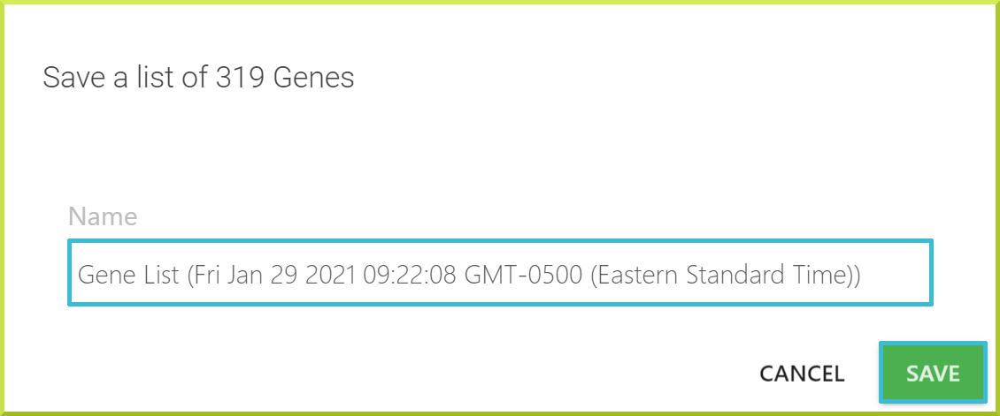

The new list will be saved, and a  message will appear at the bottom of the screen if your list creation was successful. 

### Download a set of results

Results tables can be downloaded in various standard formats using the **Export** button at the top of the table's header. You can select whether to export your results table in **TSV**, **CSV**, or **FASTA** format.   By default, the output format is set to TSV, and the downloaded results table will be saved to a file. 

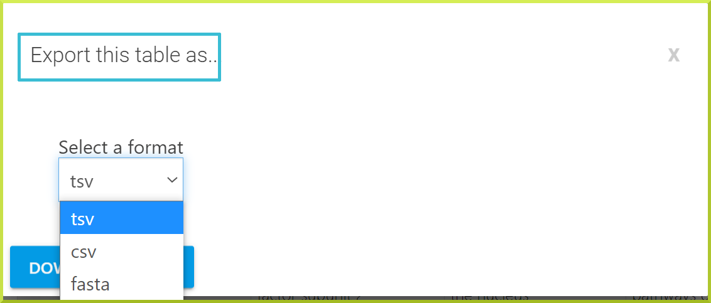

### Troubleshooting

### I have added a new column of data, but now I get ‘No results’

The InterMine data model comprises classes and fields - or attributes - Each class has a set of fields depending on the type of data. For example, Gene is a class and has the Primary identifier, Name and Symbol fields_,_ among others. If the new data you are adding to your results is a field from a class already in your results your new results table should be the same as your original results, but of course with the new column of data. If this field does not contain any data, it doesn’t matter, and it will just say "No value". However, if you are adding a field of data from a new class that is not already in your results, there is a chance that your search will now return **No results** if it does not contain any data for the set of constraints you already have in your query.

### I can’t see my list in the drop-down when I use the **Add to existing list** function.

First, make sure you are logged in so you can access your saved lists. Besides, make sure the type of the list \(e.g. genes or proteins\) is the same as the list you are trying to add to because the drop-down menu only shows lists of the same type of objects.

