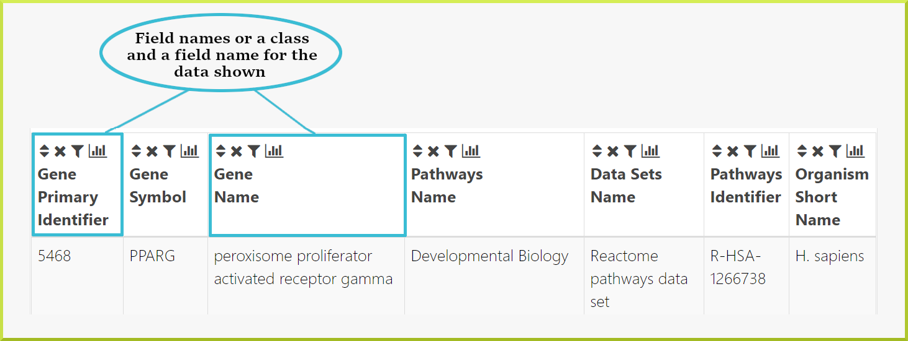
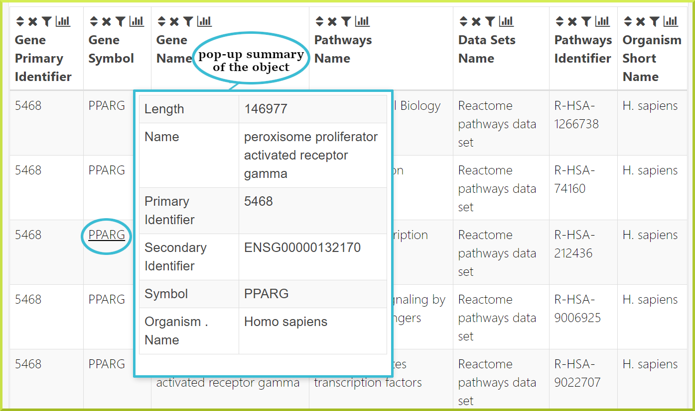
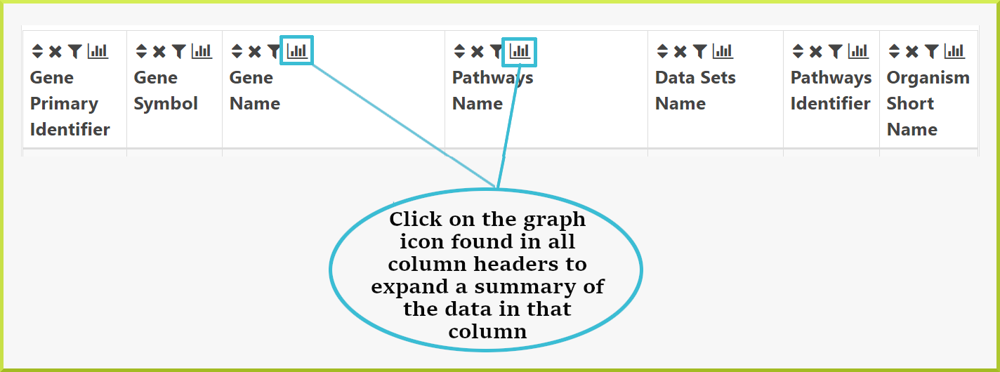

# Results Tables

Running any search from available [template searches ](template-search.md)or using the [query builder](the-query-builder.md) will return results as a results table. Results tables are also used to display the contents of a particular list on list analysis pages. Results tables are not limited to showing search results, but they are also considered powerful analysis tools. They allow you to summarise, filter, add or remove columns, create lists, and download data.

### Understanding and navigating through the data

The first thing to note on results tables is the number of rows returned by your query. By default, the number of rows shown per page is10 and can be changed to 20, 50, 100, or 250 rows per page. For large data sets, you can navigate through your results one page at a time using the backward/forward arrow icons◀▶or you can go straight to the last or the first page using the skip icons.  

The second thing to note is the column headings, which give the field name for the data shown and - in some cases - the class the data comes from. For example, in the following results table, the first two columns give a gene primary identifier and a gene symbol. The next column gives the gene name and the pathway identifier and so on. 

### Finding out more - links

Columns showing certain object identifiers or symbols will be linked to the [Report Pages](report-pages.md) for that object. In addition, hovering over a given cell in the table shows a pop-up summary of the object, which gives more details about its main attributes.

### Column Summaries

A summary of the data in each column of a results table can be accessed by clicking on the graph icon📊in the column header.

The type of summary shown depends on the type of data in the column - whether it is text or numerical data. For example, the results table below is showing pathways associated with a list of fly genes. The summary for the pathway ‘Name’ column, therefore,  shows the number of each pathway in your list \(i.e. the number of genes annotated to that pathway\):

whereas, the following column of numerical data \(gene expression scores from a microarray experiment\) shows the minimum and maximum values, the mean and standard deviation of data.

Note that your results can also be filtered through the column summary. Either select the relevant checkboxes or enter some text in the filter field AND THEN select the relevant checkboxes. For numerical data, use the sliders to select the range of data you wish to view and click apply. Click on the **filter** button to re-draw the table with your filters:

To remove a filter, either use the **UNDO** button at the top of the table or click on the green filter icon in the column header and remove the filter from there:

**Column summary graph:**

The graph shown at the top of a column summary gives an idea of the distribution of the data. This graph is interactive - clicking on a bar in the graph will select that item in the table.

### Some applications of column summaries:

Column summaries are, of course, useful for a number of reasons. However here are a few ideas for how they can be used:

1. For a list of genes, find how many have the same annotation \(where annotation could be anything associated with your genes such as GO terms, pathways or diseases\).

You have a list of D. melanogaster genes and want to know which pathways they are involved in. You have uploaded your list to FlyMine and now run the _Gene → Pathways_ template with your list of genes. The results table lists your genes and the names of all the pathways they are involved in. By clicking on the **column summary** for the _pathway.name_ column you can now find out how many genes are associated with each pathway. In the example shown below, 5 of the genes in the list are associated with the _Gene expression_ pathway. You may wish to analyse just this set of genes further. By filtering the table for this set you could then create a list of this set of genes - see [Save a results set for further analysis]() for how to create a list of genes.

1. Find the number of unique genes in your results

Often a results table will have multiple rows with information about several genes. By looking just through the table it will be difficult to know how many genes you have in your results. You can use the column summary to give you this information.

For example, You run the template search _GO term name \(and children of this term\) → Genes in a specific organism_ to find all genes involved in DNA binding in _D. melanogaster_. The results table gives 1,043 rows but as there are multiple GO terms for each gene you do not know how many genes you have. By clicking on the **column summary** for either the gene secondary identifier \(the CGXXXX id\) or the gene symbol you can find the number of unique genes, in this example 829. In addition, the summary tells you how many GO terms are associated with each gene. Note that if you create a list of these genes \(see [Save a results set for further analysis]()\) you will create a list of 829 unique genes.

## Apply a filter to your results

The results tables allow you to explore your results by applying filters to any of the columns of data. Filters can be applied through the **Filters** box above the results table. Note that filters can also be applied through the [Column Summaries]().

The ‘Filter’ feature allows you to edit or remove any existing filters and add new filters to your results. Any currently active filters are shown when you click on the **Filters** button. These can be removed or edited from here:

**To add a new filter:**

1. Click on **Define a new filter**
2. Browse for the data field you want to filter on
3. Select the field and click on **Choose**
4. Define your filter
5. Click on **Apply** to re-draw the results table with your filter in place

**HINT:** If you are having trouble working out which field to filter, take a look at the column headers in your results table. If you click within the header the full path to the field is shown. Follow the same path through the model browser in the filter box.

>

**Returning to your original results:**

Filters can be removed through the filter box as shown above. Alternatively, you can use the **UNDO** button above the results to return to previous states - if you have added multiple filters, you can go back to any previous state of your results table or straight back to its original state. Note that the original state may still have filters applied - this refers to the original query run, not to a table with no filters applied:

### Manage columns: Add, Remove, Rearrange and Sort

The Manage Columns feature allows you to add or remove columns, rearrange their order and sort them.

## Manage columns: Removing and rearranging columns from your results

1. Click on **Manage columns**: a list of columns already in your results is shown.
2. Remove a column by clicking on the **green circle**.
3. Rearrange the column order by picking up the row and moving it.

## Manage columns: Adding additional columns of data to your results

Additional fields of data can be added to your results using the **Manage Columns** feature. This feature allows you to browse all fields available and select those you wish to add:

1. Click on **Manage columns**
2. Select **Add a new column**.
3. Browse the fields to find the one you require.
4. Click on the field to add that data to your results
5. Click **Apply** to re-draw the results table

**HINT**: If you do not know which field contains the data you require or how to navigate through the model to that data try looking at the column headers in your results table. If you click within the header the full path to the field is shown. If you are looking for additional fields for the same type of data, follow the same path through the model browser. If you are unsure which fields contain the data you are after, try adding one or more and re-drawing the table - it is easy to remove them again. Alternatively, just [Contact Us](https://flymine.readthedocs.io/en/latest/contact/Documentationcontact.html#contact) and we should be able to help.

## Manage columns: Changing the sort order of columns in your results

There are two ways to change the sort order of the columns in your results tables. First, every column header has a sort ‘icon’ which allows you to sort on a specific column in either direction \(a-&gt;z; z-&gt;a etc.\):

The second way to set the sort order is through the **Manage columns** function. Here you can define the sort order of all columns in your table under the **Configure sort order** sub-tab:

By default, the table is usually sorted according to the first column in your results \(occasionally a template search may be sorted on a column other than the first\). The column the table is currently sorted on is shown in the top of the ‘configure sort-order’ box. You can set your table to be sorted on any column present in the table, and also on additional fields of data not shown in your results. By default, only the columns in your table are shown. Additional fields can be shown by de-selecting the **Only show columns in the table** checkbox.

Data fields are shown with their full path. Hint: check the last value and the second-to-last value to find the class and field that you want. Additionally, use the filter box to help you find the correct field. Fields can be added to the sort order by clicking on the ‘+’ or by picking up and dragging to the box at the top. Remove fields from the sort order using the ‘-’ or by dragging to the bottom:

## Save a result set for further analysis[¶]()

Lists of objects can be saved from results tables to your InterMine account \(or temporarily for the duration of your session if you are not logged in\). A list of objects can contain only one type of object. For example,  if you have a results table showing both genes and proteins you can create a list of all or some of the genes and another list of all or some of the proteins. However, you cannot create a mixed list of genes or proteins or save the table maintaining the association between each gene and protein. You can, of course, download the full table or subsets of it - see [Download a set of results]().

To create a list, or add objects to an existing list, use the **Create/Add to list** function: The default, create a new list, provides you with the sets of objects available to save - selecting one of these highlights the set of objects it refers to. The final option, **choose individual items from the table**, provides checkboxes for selecting the objects you wish to save.

Once you have made your selection, give your list a name and optional description in the box provided. If you are logged in you will also have the option to ‘tag’ your list. See [List Tags](https://flymine.readthedocs.io/en/latest/lists/overview/Documentationlists.html#listtags) for more information on tagging. Finally, click **create**. A message will appear at the top of the screen if your list creation was successful and this provides a link to view your list:

The **Add to existing list** works in exactly the same way, except instead of providing a new list name, you select the list you want to add to from a drop-down list.

## Download a set of results

Results tables can be downloaded in various standard formats using the **Download** function. Here you can select the format and configure your table to download the parts that you require - columns can be added, removed or re-ordered and the rows can be selected. By default, results will be downloaded ‘uncompressed’ and will include the column headers. However, these options can be changed under the ‘Output’ sub-tab. In addition, results are saved to a file by default. However, under the **Destination file** sub-tab, you can save a URI, query XML or send your results to Galaxy, see [Send results to galaxy]()

## Send results to Galaxy

[Galaxy](http://galaxyproject.org/) is a popular web-based bioinformatics analysis and workflow platform. InterMine results can be sent directly to Galaxy for further analysis. Under the **Download** function, configure the format and results you wish to send and select **Send to galaxy for analysis** under the **Destination** sub-tab AND click the green **Send to galaxy** button. The main public galaxy server is set by default. However, if you wish to use a different instance of galaxy or your own local galaxy installation you can set this here. You can also change the default setting for the galaxy server in your [MyMine](https://flymine.readthedocs.io/en/latest/mymine/DocumentationMyMine.html#mymine) account.

### Troubleshooting

### I have added a new column of data but now I get ‘No results’

The InterMine data model is made up of classes and fields - or attributes - and each class has a set of fields depending on the type of data. For example, Gene is a class and has the Primary identifier, Name and Symbol fields_,_ among others. If the new data you are adding to your results is a field from a class already in your results your new results table should be the same as your original results, but of course with the new column of data. If this field does not contain any data, it doesn’t matter, it will just say ‘No value’. However, if you are adding a field of data from a new class that is not already in your results there is a chance that your search will now return **No results** if it does not contain any data for the set of constraints you already have in your query.

### I can’t see my list in the drop-down when I use the **Add to existing list** function.

First, make sure you are logged in so you can access your saved lists. In addition, make sure the type of the list \(e.g. genes or proteins\) is the same as the list you are trying to add to because the drop-down menu only shows lists of the same type of objects.

